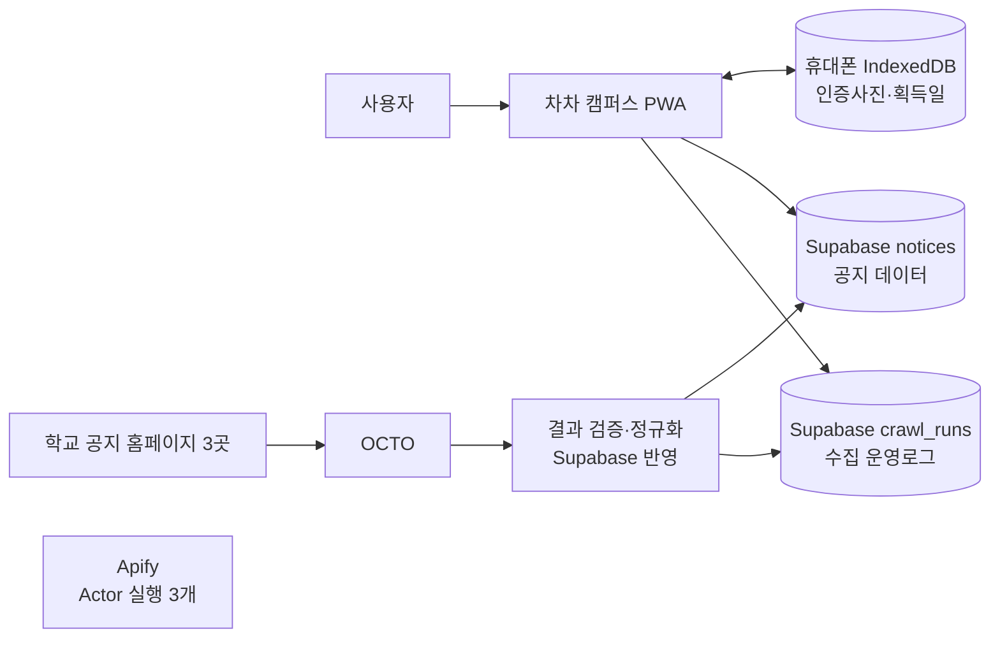
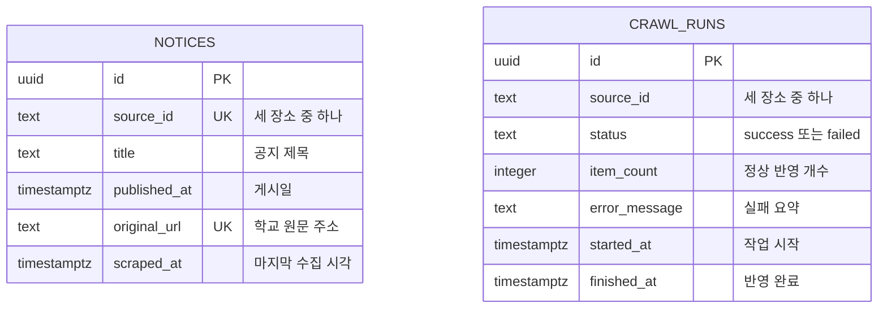

# 차차 캠퍼스 데이터 구조

이 문서는 최종 제출 항목인 **회원, 서비스 데이터, 사용로그**가 어디에 저장되는지 쉬운 말로 설명한다. 실제 데이터베이스 작업과 검증은 Supabase 플러그인으로 수행하고, 공지 추출은 Apify MCP가 담당한다.

운영자가 직접 공지를 갱신하는 순서는 `docs/MANUAL_NOTICE_REFRESH.md`에 있다.

## 1. 먼저 알아야 할 핵심

차차 캠퍼스는 로그인 없는 MVP다. 그래서 데이터베이스에 회원을 억지로 만들지 않는다.

| 제출 항목 | 이 프로젝트의 처리 | 이유 |
| --- | --- | --- |
| 회원 | Supabase Auth와 회원 테이블을 사용하지 않음 | PRD에서 회원가입·로그인·기기 간 동기화를 제외함 |
| 서비스 데이터 | Supabase의 `notices` | 모든 사용자가 함께 보는 학교 공지 정보 |
| 운영로그 | Supabase의 `crawl_runs` | Apify 수집과 Supabase 반영이 성공했는지 확인 |
| 사용자 행동로그 | 수집하지 않음 | 로그인도 없고 개인 행동을 추적할 제품 요구도 없음 |
| 인증사진·캐릭터 획득 | 각 휴대폰의 IndexedDB | 사진을 서버에 올리지 않기 위함 |

여기서 `crawl_runs`는 **사용자가 무엇을 눌렀는지 기록하는 로그가 아니다.** 공지 수집 시스템이 정상적으로 일했는지를 남기는 운영 기록이다.

## 2. 전체 데이터 흐름



쉬운 순서:

1. Apify Actor가 학교 홈페이지 세 곳에서 제목, 날짜, 원문 링크를 가져온다.
2. 가져온 값이 올바른지 검사하고 세 출처를 같은 형식으로 바꾼다.
3. 정상 공지는 Supabase의 `notices`에 저장한다.
4. 성공 또는 실패 결과는 `crawl_runs`에 남긴다.
5. 앱은 Supabase에서 공지를 읽기만 한다.
6. 인증사진과 캐릭터 기록은 휴대폰 안에만 남고 이 흐름에 들어오지 않는다.

## 3. Supabase에 실제로 있는 테이블



두 테이블은 같은 `source_id`를 사용하지만 외래 키로 직접 연결하지 않는다.

허용하는 출처 ID:

- `library`: 충남대학교 중앙도서관
- `language-center`: 충남대학교 국제언어교육센터
- `industry-center`: 충남대학교 산학연교육연구관

### `notices`: 앱이 보여주는 공지

저장하는 것:

- 어느 장소 공지인지
- 공지 제목
- 게시일
- 학교 홈페이지의 원문 링크
- 마지막으로 수집한 시각

저장하지 않는 것:

- 공지 본문
- 첨부파일
- 학교 홈페이지 HTML 전체
- Apify API token

같은 출처의 같은 원문 링크는 한 번만 저장한다. 그래서 다음 수동 갱신에서 같은 공지를 다시 발견해도 중복 공지가 계속 늘어나지 않는다.

### `crawl_runs`: 공지 수집 운영로그

한 행은 한 출처의 Apify 결과를 Supabase에 반영한 한 번의 시도를 뜻한다.

- `success`: Apify 결과 검증과 Supabase 저장이 모두 끝남
- `failed`: 추출, 결과 전달, 날짜 해석 또는 DB 저장 중 하나가 실패함
- `item_count`: Apify가 찾은 전체 개수가 아니라 실제로 정상 반영한 공지 개수
- `error_message`: 비밀값과 HTML 원문을 제외한 짧은 실패 이유

Apify Actor/run ID와 상세 실행 기록은 Apify에 남긴다. 현재 Supabase 스키마에는 외부 작업 ID 컬럼이 없다. 나중에 DB에서도 실행을 1:1로 추적해야 한다는 요구가 생기면 PRD를 먼저 변경하고 후속 마이그레이션으로 `external_run_id`를 추가한다.

## 4. 회원 데이터

현재 회원 ERD는 **없다**.

```text
Supabase Auth: 사용 안 함
profiles 테이블: 만들지 않음
회원 ID: 없음
사용자별 서버 데이터: 없음
```

이것은 빠진 기능이 아니라 의도한 설계다. 회원을 만들면 로그인 화면, 비밀번호·세션 관리, 사용자별 RLS, 사진 소유권과 탈퇴 처리가 추가되어 현재 24시간 MVP의 범위를 크게 벗어난다.

최종 제출에서는 다음처럼 설명한다.

> 회원: 사용하지 않음. 차차 캠퍼스 MVP는 로그인 없이 동작하며 인증사진과 캐릭터 기록은 각 기기에만 저장됩니다.

회원 기능을 나중에 추가하려면 ERD에 테이블만 먼저 그리지 않는다. `PRD.md`에서 로그인, 동기화, 개인정보 보관 기간, 탈퇴 시 삭제 규칙을 먼저 결정해야 한다.

## 5. 휴대폰에만 있는 도감 데이터

이 데이터는 Supabase ERD에 포함하지 않지만 전체 시스템을 이해하기 위해 함께 적는다.

```ts
type CollectionRecord = {
  placeId: "library" | "language-center" | "industry-center";
  acquiredAt: string;
  photoBlob: Blob;
  photoMimeType: string;
};
```

| 규칙 | 설명 |
| --- | --- |
| 저장 위치 | 사용자 휴대폰 브라우저의 IndexedDB |
| 고유 키 | `placeId` |
| 중복 | 한 장소당 최초 한 번만 저장 |
| 서버 전송 | 하지 않음 |
| 삭제 | 브라우저 데이터 삭제나 앱 제거 시 사라질 수 있음 |

## 6. Apify와 Supabase의 역할 분리

| 단계 | 담당 | 하는 일 |
| --- | --- | --- |
| 홈페이지 HTML 읽기 | Apify MCP·Actor 실행 | 세 홈페이지에서 필요한 칸을 추출 |
| 출처별 설정 | Apify Actor 실행 3개 | 사이트마다 다른 화면 구조와 날짜 형식을 처리 |
| 결과 검사 | 앱의 서버 측 import 코드 | 필수값, 허용 출처, 날짜, URL을 검증 |
| 중복 방지와 저장 | Supabase | `(source_id, original_url)` 기준 upsert |
| 성공·실패 기록 | Supabase `crawl_runs` | 출처별 반영 결과 보존 |

애플리케이션은 학교 홈페이지 HTML을 직접 `fetch`하거나 `cheerio`로 파싱하지 않는다. 그 일은 Apify가 맡는다. 애플리케이션에는 Apify가 내보낸 결과를 안전한 공통 형식으로 바꾸는 작은 import 경계만 둔다.

Apify 쪽에서 확인할 항목:

- 출처별 작업이 정확히 3개인지
- 추출 필드가 `source_id`, `title`, `published_at`, `original_url`인지
- 운영자가 요청할 때만 수동으로 실행되는지
- 한 출처 실패가 다른 출처 결과를 없애지 않는지
- 최근 실행 결과와 Supabase 저장 표본이 일치하는지

Apify MCP 연결에는 OAuth 또는 API token과 계정 권한이 필요할 수 있다. token은 비밀번호처럼 취급하고 저장소에 넣지 않는다. 계정 요금제가 Actor 실행과 dataset 내보내기를 지원하는지도 실제 계정에서 확인해야 한다.

## 7. Supabase 권한

| 역할 | 읽기 | 쓰기 |
| --- | --- | --- |
| 공개 앱 `anon` | `notices`, 성공한 `crawl_runs`만 | 모두 거부 |
| 로그인 사용자 `authenticated` | 사용하지 않음 | 사용하지 않음 |
| 서버 `service_role` | 허용 | 공지 import와 실행 기록에 필요한 작업만 허용 |

두 테이블 모두 RLS를 켠다. `GRANT`는 테이블에 접근할 수 있는지를 정하고, RLS는 그 안에서 어떤 행을 볼 수 있는지를 정한다. 둘 중 하나만 설정해서는 충분하지 않다.

브라우저에는 publishable key만 전달한다. `SUPABASE_SECRET_KEY` 또는 service role key는 브라우저 코드, Git, 로그에 들어가면 안 된다.

현재 적용된 `20260825102516_create_notice_data_foundation.sql`의 공개 정책은 실패한 `crawl_runs`도 읽을 수 있다. 후속 마이그레이션 `supabase/migrations/20260825154500_restrict_crawl_runs_public_read_to_success.sql`을 작성해 `status = 'success'` 행만 공개하도록 정책을 교체했지만, 현재 세션에서는 Supabase 플러그인 인증이 되지 않아 원격 프로젝트에 아직 적용하지 못했다. 플러그인이 연결되면 적용 전에 이 파일을 우선 실행하고 다음을 Supabase 플러그인으로 확인한다.

1. `anon` 공지 SELECT 성공
2. `anon` 공지 INSERT·UPDATE·DELETE 실패
3. `anon` 성공 실행 SELECT 성공
4. `anon` 실패 실행과 `error_message` SELECT 결과 0건
5. 서버 역할의 필요한 쓰기 성공
6. Security Advisor 오류 0건

Supabase는 새 테이블을 Data API에 자동 공개하지 않는 방향으로 정책이 바뀌고 있으므로, 새 테이블은 필요한 `GRANT`와 RLS를 같은 마이그레이션에서 명시한다.

## 8. 인덱스와 자주 하는 조회

- `notices_source_published_idx (source_id, published_at desc)`: 장소별 최근 공지를 빠르게 찾는다.
- `crawl_runs_source_finished_idx (source_id, finished_at desc)`: 장소별 마지막 성공 반영 시각을 빠르게 찾는다.

앱이 자주 하는 조회:

1. 선택한 장소의 오늘 포함 최근 7일 공지를 최신순으로 읽기
2. 선택한 장소의 가장 최근 `success` 실행 한 건 읽기

## 9. 실제 상태와 목표 상태

| 항목 | 현재 상태 | 다음 행동 |
| --- | --- | --- |
| Supabase 프로젝트 | 생성됨 | 세션마다 Supabase 플러그인으로 대상 프로젝트 재확인 |
| `notices`, `crawl_runs` | 최초 마이그레이션 2개 적용됨. 실패 실행 비공개 후속 마이그레이션은 파일로 작성됐으나 미적용 | Supabase 플러그인 연결 후 후속 마이그레이션 적용과 Advisor 재확인 |
| 브라우저/서버 Supabase 클라이언트 | `src/lib/supabase/public.ts`, `src/lib/supabase/server.ts` 구현 완료 | 실제 원격 프로젝트 연결 후 anon 읽기·쓰기 거부 브라우저 검증 |
| KST 최근 7일 경계 유틸리티 | `src/lib/notices/date-kst.ts`와 자동 테스트 완료 | W12 공지 조회 화면에서 사용 |
| 회원·Auth | 없음 | PRD가 바뀌지 않는 한 만들지 않음 |
| 사용자 행동로그 | 없음 | 제품 요구가 없으므로 만들지 않음 |
| Apify MCP | OAuth 연결 및 세 출처 실제 Actor 실행 확인 | 운영자 요청 때 같은 Actor 절차 재실행 |
| Apify→Supabase 수동 반영 | 실제 30개 공지·3개 실행 로그 반영 및 표본 검증 완료 | 다음 갱신 때 성공 출처만 upsert |

Apify MCP 연결, 세 출처 Actor 실행, 결과 검증과 Supabase 반영을 2026-08-25에 실제로 확인했다. 이후 갱신에서도 같은 수동 절차와 출처별 성공·실패 분리를 유지한다.

## 10. 최종 제출 형식

```text
데이터베이스: <Supabase 프로젝트 이름>
- 회원: 사용 안 함 — 로그인 없는 MVP
- 서비스 데이터: notices — 공지 제목·날짜·원문 링크
- 운영로그: crawl_runs — Apify 결과 반영 성공·실패
- 사용자 행동로그: 수집 안 함
- 보안: RLS, anon 쓰기 거부, Security Advisor 확인

공지사항 크롤링: Apify MCP
- 작업: library / language-center / industry-center
- 필드: source_id / title / published_at / original_url
- 실행: 운영자가 `공지 갱신해줘`라고 요청할 때만 수동 실행
- 검증: 최근 실행 결과와 Supabase 저장 표본 비교
```

## 11. 실제 마이그레이션

- `supabase/migrations/20260825102516_create_notice_data_foundation.sql` (원격 적용됨)
- `supabase/migrations/20260825103200_restrict_notice_service_role_privileges.sql` (원격 적용됨)
- `supabase/migrations/20260825154500_restrict_crawl_runs_public_read_to_success.sql` (파일 작성 완료, Supabase 플러그인 연결 전까지 원격 미적용)

이미 적용된 마이그레이션 파일은 덮어쓰지 않는다. 변경은 새 후속 마이그레이션으로 만들고 Supabase 플러그인에서 실제 적용 결과와 Advisor를 확인한다.

## 12. 참고한 공식 문서

- Supabase API 보안: <https://supabase.com/docs/guides/api/securing-your-api>
- Supabase 변경 내역: <https://supabase.com/changelog>
- Apify MCP 연결: <https://docs.apify.com/integrations/mcp>
- Apify Actor 실행·dataset 결과: <https://docs.apify.com/platform/actors/running>
