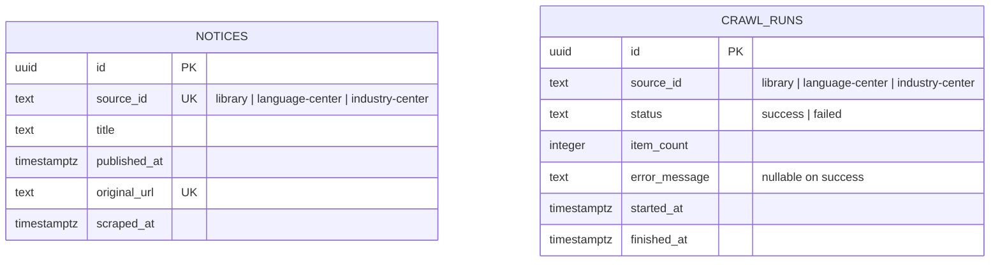

# 차차 캠퍼스 데이터 모델

이 문서는 `PRD.md` 10–11장의 데이터 저장 범위를 구현 가능한 형태로 정리한다.

## Supabase ERD

`notices`와 `crawl_runs`는 `source_id`라는 동일한 논리 식별자를 사용하지만 물리 외래 키는 없다. 한 번의 크롤링 실행이 여러 공지를 수집하고 같은 공지가 여러 실행에서 다시 발견될 수 있는 구조인데, 현재 PRD에는 공지와 특정 실행을 연결하는 `crawl_run_id`가 정의되어 있지 않기 때문이다. 마지막 성공 갱신 시각은 출처별로 `crawl_runs.status = 'success'`인 행의 가장 최근 `finished_at`을 조회한다.

## 테이블 책임

| 저장소 | 데이터 | 핵심 규칙 |
| --- | --- | --- |
| Supabase `notices` | 공지 제목, 게시일, 원문 URL, 수집 시각 | `(source_id, original_url)` 중복 금지, 본문·첨부파일 미저장 |
| Supabase `crawl_runs` | 출처별 크롤링 성공·실패 이력 | 성공 시 오류 메시지 없음, 실패 시 오류 요약 필수 |
| 브라우저 IndexedDB | 장소별 획득일과 인증사진 | `placeId`당 최초 1회, 서버 전송 없음 |

사용자, 인증사진, 캐릭터 획득 이력 테이블은 만들지 않는다. 회원가입과 사용자별 서버 저장은 MVP의 명시적 제외 범위다.

## 권한 모델

| 역할 | SELECT | INSERT / UPDATE / DELETE |
| --- | --- | --- |
| `anon` | 두 테이블 허용 | 거부 |
| `authenticated` | 거부 | 거부 |
| `service_role` | 허용 | 허용 |

두 테이블 모두 RLS가 활성화되어 있다. 공개 읽기 정책은 `anon`의 `SELECT`에만 존재하며, 서버 크롤러 쓰기는 브라우저에 노출되지 않는 `SUPABASE_SECRET_KEY`로 수행한다.

## 인덱스와 조회 패턴

- `notices_source_published_idx (source_id, published_at desc)`: 장소별 최근 7일 공지를 최신순으로 조회한다.
- `crawl_runs_source_finished_idx (source_id, finished_at desc)`: 장소별 최근 성공 갱신 시각을 조회한다.

실제 DDL과 최소 권한 보정은 다음 마이그레이션에 있다.

- `supabase/migrations/20260825102516_create_notice_data_foundation.sql`
- `supabase/migrations/20260825103200_restrict_notice_service_role_privileges.sql`
