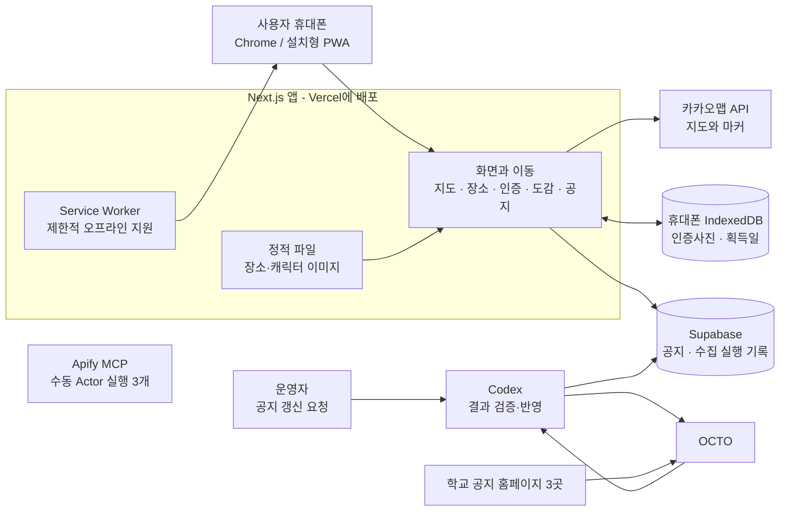
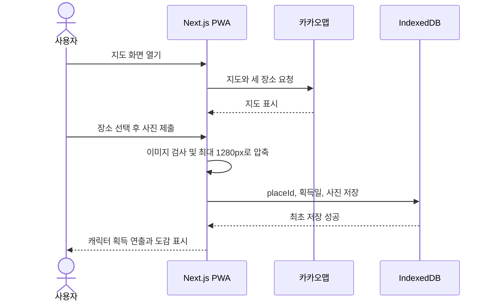
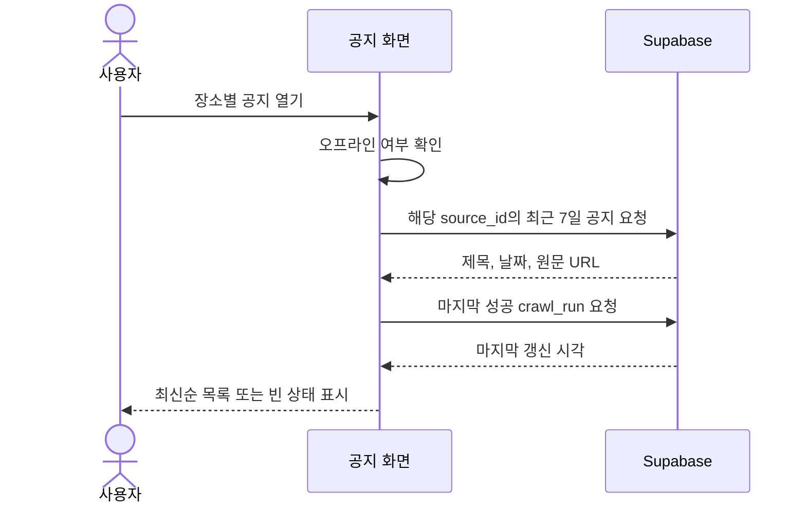
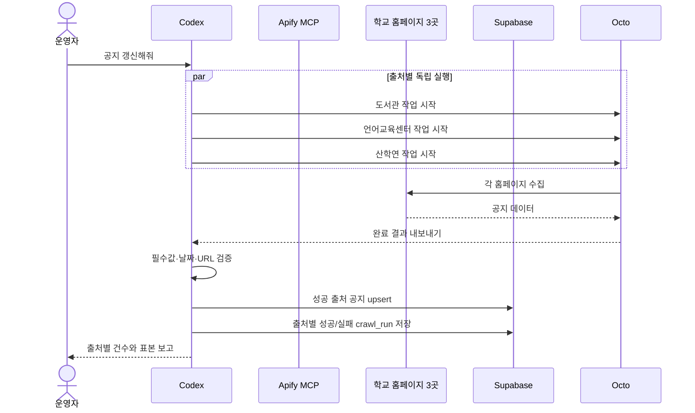
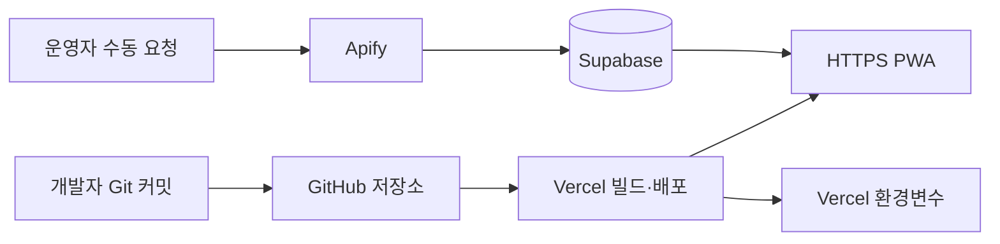

# 차차 캠퍼스 전체 시스템 구조

## 0. 이 문서의 역할

이 문서는 차차 캠퍼스를 **어떤 부품으로 나누고, 각 부품이 무슨 일을 하며, 데이터가 어디로 이동하는지** 설명하는 시스템 설계 기준이다. 개발 경험이 없는 사람도 전체 모습을 이해할 수 있도록 쉬운 표현을 먼저 쓰고, 개발자가 구현할 때 필요한 세부 규칙을 함께 적는다.

- `PRD.md`: 무엇을 만들지 결정하는 최상위 기준
- 이 문서: 그것을 어떤 구조로 만들지 결정하는 기준
- `docs/DEVELOPMENT_PRIORITY.md`: 어떤 순서로 만들지 결정하는 기준
- `docs/dev-logs/`: 실제로 어디까지 만들었는지 알려주는 기록

제품 기능이나 범위가 충돌하면 `PRD.md`가 우선한다. 구현 순서는 `docs/DEVELOPMENT_PRIORITY.md`가 우선한다. 이 문서는 두 문서를 바꾸지 않고, 둘을 안정적으로 구현하는 방법을 설명한다.

마지막 갱신: 2026-08-25 KST

## 1. 가장 쉬운 한 문장 설명

차차 캠퍼스는 **휴대폰 안에서 동작하는 탐방·도감 앱**과 **하루 한 번 공지를 모아 두는 서버**를 하나의 Next.js 프로젝트로 만든 서비스다.

서비스를 두 부분으로 생각하면 쉽다.

1. **탐방과 캐릭터 수집**: 지도에서 장소를 고르고 사진을 제출한다. 사진과 캐릭터 획득 기록은 그 휴대폰에만 저장한다.
2. **공지 모음**: 운영자가 갱신을 요청하면 Apify Actor가 세 학교 홈페이지에서 공지 제목·날짜·링크를 모으고, Codex가 결과를 Supabase에 반영한다. 앱은 저장된 결과를 읽어 보여준다.

사진을 서버에 올리지 않고 로그인도 만들지 않는 것이 이 구조의 가장 중요한 단순화다.

## 2. 전체 그림



그림에서 가장 중요한 경계는 다음과 같다.

- 인증사진은 `휴대폰 IndexedDB`에서 끝난다. Vercel이나 Supabase로 보내지 않는다.
- 브라우저는 Supabase의 공개 읽기 권한만 사용한다.
- Supabase 쓰기와 Apify Actor 실행은 연결된 MCP를 통해 운영자가 요청한 때만 수행한다.
- 학교 홈페이지 크롤링은 브라우저나 앱 서버가 아니라 Apify가 수행한다.

## 3. 왜 이 구조가 이 프로젝트에 적합한가

### 하나의 앱으로 유지한다

프런트엔드, 공지 API, 배포 설정을 하나의 Next.js 저장소에 둔다. 별도 백엔드 서버나 여러 마이크로서비스를 만들지 않는다.

이유:

- 3명이 24시간 안에 만들고 연결하기 쉽다.
- Vercel 한 곳에서 화면과 예약 API를 함께 배포할 수 있다.
- 배포 위치와 오류 확인 지점이 줄어든다.
- 기능별 파일은 분리하므로 코드가 한 덩어리로 뒤엉키지는 않는다.

### 사용자 데이터는 휴대폰에 둔다

인증사진과 캐릭터 획득 기록은 IndexedDB에 저장한다.

이유:

- 회원가입과 로그인이 필요 없다.
- 사진 업로드, 저장 비용, 개인정보 관리 범위가 사라진다.
- 오프라인에서도 도감을 볼 수 있다.
- 한 장소당 사진 한 장을 Blob 형태로 저장하기에 `localStorage`보다 적합하다.

대신 브라우저 데이터를 지우거나 앱을 삭제하면 기록이 사라지고, 다른 기기로 옮길 수 없다. 이는 오류가 아니라 MVP에서 의도한 제한이다.

### 공지만 서버에 둔다

세 기관의 공지는 여러 사용자가 같은 내용을 보므로 Supabase에 한 번 저장하고 모두가 읽는다. 공지 본문이나 첨부파일은 복제하지 않고 제목, 날짜, 원문 링크만 저장한다.

이유:

- 학교 홈페이지가 잠시 느리거나 실패해도 마지막 성공 결과를 보여줄 수 있다.
- 사용자가 화면을 열 때마다 학교 사이트 세 곳을 다시 요청하지 않는다.
- 한 출처가 실패해도 다른 출처를 독립적으로 갱신할 수 있다.

## 4. 부품별 책임

| 부품 | 쉬운 설명 | 맡는 일 | 맡지 않는 일 |
| --- | --- | --- | --- |
| Next.js 화면 | 사용자가 보는 앱 | 화면, 경로 이동, 정적 장소 정보 표시 | 공지 사이트 직접 크롤링 |
| 브라우저 Client Component | 휴대폰 기능을 쓰는 화면 조각 | 카카오맵, 사진 선택·압축, IndexedDB, 온라인 상태, 공개 Supabase 공지 조회 | 서버 비밀 키 사용 |
| Server Component | 서버에서 미리 만드는 화면 조각 | 정적 장소 소개, 기본 화면 구조 | 브라우저 카메라·IndexedDB 접근 |
| IndexedDB | 휴대폰 안 작은 개인 보관함 | 장소별 인증사진과 획득일 저장 | 여러 기기 동기화, 서버 백업 |
| Service Worker | 오프라인용 임시 안내원 | 앱 셸과 정적 소개·캐릭터 자산 캐시 | 지도 타일과 최신 공지 캐시 |
| 카카오맵 API | 외부 지도 공급자 | 지도와 세 고정 마커 표시 | GPS 방문 판정 |
| 공개 Supabase 클라이언트 | 읽기 전용 창구 | 공지와 마지막 성공 갱신 시각 조회 | 추가·수정·삭제 |
| Apify Actor 실행 3개 | 홈페이지별 수집 담당자 | 서로 다른 HTML에서 제목·날짜·링크 추출 | Supabase 직접 공개 쓰기 |
| Codex 수동 갱신 흐름 | 운영자가 부르는 정리 담당자 | 작업 시작, 완료 대기, 결과 검증, Supabase 반영 | 자동 예약 실행 |
| Supabase | 공용 공지 창고 | `notices`, `crawl_runs` 저장과 읽기 권한 제어 | 사용자·사진·도감 저장 |
| Vercel | 앱이 실제로 사는 곳 | HTTPS 배포와 공개 환경변수 | 공지 자동 예약, 장기 사진 보관 |

## 5. 핵심 사용자 흐름: 지도에서 도감까지

이 흐름은 서버 장애와 무관하게 사진 제출 이후를 끝낼 수 있도록 대부분 휴대폰 안에서 처리한다.



세부 규칙:

1. 장소 정보는 앱 코드에 들어 있는 고정 데이터에서 읽는다.
2. 지도는 온라인일 때만 카카오맵 API에서 받는다. GPS 권한은 요청하지 않는다.
3. 사진은 이미지 파일인지 확인하고, 브라우저에서 최대 변 1280px·품질 약 0.75로 압축한다.
4. `placeId`를 고유 키로 IndexedDB에 `add`한다.
5. 같은 장소가 이미 있으면 기존 사진과 획득일을 바꾸지 않는다.
6. 저장이 실제로 성공한 뒤에만 획득 성공 화면을 보여준다.
7. 네트워크가 없어도 사진 선택, 저장, 도감 확인은 동작해야 한다.

## 6. 공지를 읽는 흐름

앱은 학교 홈페이지를 직접 읽지 않고 Supabase에 저장된 결과를 읽는다.



구현 기준:

- 브라우저용 Supabase publishable key와 RLS의 `anon SELECT`만 사용한다.
- `crawl_runs`의 공개 읽기는 `status = 'success'`인 행으로 제한한다. 실패 메시지는 운영 확인용이며 브라우저에 공개하지 않는다.
- 장소별 `source_id`가 다른 공지와 섞이지 않게 조회한다.
- 오늘을 포함한 KST 달력 날짜 7개만 표시한다.
- 공지가 0건이면 PRD에 따른 빈 상태를 보여준다.
- 원문은 새 탭에서 학교 홈페이지를 연다.
- 오프라인, 로딩, 빈 결과, 조회 오류를 서로 다른 상태로 표시한다.
- `SPEC.md`에 제안된 `지난 공지 3건` 폴백은 현재 PRD에 없는 확장이므로 PRD가 변경되기 전에는 구현하지 않는다.

## 7. 공지를 모으는 흐름



반드시 지킬 규칙:

- 운영자가 `공지 갱신해줘`라고 명시적으로 요청할 때만 실행한다.
- 일반 앱 화면에는 갱신 버튼이나 비밀 키를 넣지 않는다.
- Apify Actor 실행 세 개는 서로 독립적으로 시작하고 결과를 따로 판정한다.
- 성공한 출처만 upsert한다. 실패한 출처의 기존 공지는 지우지 않는다.
- 날짜를 해석하지 못한 항목은 저장하지 않고 실패 원인을 기록한다.
- 페이지 HTML 전체를 DB에 저장하지 않는다.
- 공지 본문과 첨부파일을 저장하지 않는다.
- 자동 갱신과 Vercel Cron은 사용자가 다시 요청하기 전까지 구현하지 않는다.

출처별로 이미 확인된 차이:

| 출처 | 목록 URL/선택자 주의점 | 날짜 | 링크 |
| --- | --- | --- | --- |
| `library` | 실제 HTML fixture로 선택자 재검증 | `YYYY-MM-DD` | 루트 상대 경로 가능 |
| `language-center` | 고정 공지가 많아 1페이지 전체 행을 읽음 | `YYYY-MM-DD` | 문서 상대 경로 가능 |
| `industry-center` | 목록 URL에 `?mode=list` 필요 | `YY.MM.DD` | 쿼리 상대 경로 가능 |

상대 링크는 모두 `new URL(href, listUrl)`로 절대 URL로 만든다. 홈페이지 구조는 바뀔 수 있으므로 구현 시점에 HTML fixture를 새로 저장하고 테스트한다.

## 8. 데이터는 어디에 저장되는가

| 데이터 | 저장 위치 | 서버 전송 | 삭제되는 때 |
| --- | --- | --- | --- |
| 장소 이름·좌표·소개·이미지 경로 | Git에 포함된 정적 파일 | 배포 시 전달 | 새 배포에서 변경할 때 |
| 인증사진 | 사용자 기기의 IndexedDB | 하지 않음 | 브라우저 데이터 삭제·앱 제거 등 |
| 캐릭터 획득일 | 사용자 기기의 IndexedDB | 하지 않음 | 브라우저 데이터 삭제·앱 제거 등 |
| 캐릭터 이미지 | 앱 정적 자산 | 배포 시 전달 | 새 파일 배포 시 |
| 공지 제목·날짜·원문 URL | Supabase `notices` | 서버 크롤러가 저장 | 운영 정책에 따른 정리 시 |
| 수집 성공·실패 기록 | Supabase `crawl_runs` | 서버 크롤러가 저장 | 운영 정책에 따른 정리 시 |
| 비밀 키 | 로컬 `.env.local`, Vercel 환경변수 | Git에 저장 금지 | 키 교체 시 |

서버에 만들지 않는 테이블:

- 사용자 테이블
- 인증사진 테이블
- 캐릭터 획득 테이블
- 로그인 세션 테이블
- 장소 테이블

장소가 세 개로 고정되어 있으므로 장소 정보는 DB가 아니라 타입이 있는 로컬 파일이 더 단순하고 안전하다.

## 9. 코드 구조 기준

아직 앱 코드가 없으므로 아래는 W00부터 따라야 할 목표 구조다. 이름은 구현 과정에서 조금 달라질 수 있지만 각 폴더의 책임 경계는 유지한다.

```text
src/
  app/
    page.tsx                         # 지도 화면
    places/[slug]/page.tsx          # 정적 장소 소개
    places/[slug]/verify/page.tsx   # 사진 선택과 방문 인증
    places/[slug]/notices/page.tsx  # 장소별 공지
    collection/page.tsx             # 캐릭터 도감
  components/
    map/                             # 카카오맵 전용 Client Component
    collection/                      # 도감과 획득 표시
    photo/                           # 사진 입력·미리보기 UI
    notices/                         # 로딩·빈 결과·오류·목록 UI
    layout/                          # 하단 내비게이션 등 공통 UI
  data/
    places.ts                        # 세 장소의 단일 기준 데이터
  lib/
    browser/
      collection-db.ts              # IndexedDB 입출력
      compress-image.ts             # 브라우저 이미지 압축
    notices/
      types.ts                       # NoticeInput 등 공통 계약
      date-kst.ts                    # KST 7일 경계와 날짜 변환
      validate-import.ts             # Apify 결과 검증용 순수 함수
    supabase/
      public.ts                      # 공개 읽기 전용
      server.ts                      # 서버 비밀 키 전용
  types/
    kakao-map.d.ts                   # 필요한 경우 외부 SDK 타입
public/
  places/                            # 장소 대표 이미지
  characters/                        # 장소별 캐릭터 이미지
  icons/                             # 192/512 PWA 아이콘
tests/
  fixtures/notices/                  # Apify 결과 JSON 검증 자료
supabase/
  migrations/                        # 재현 가능한 DB 변경 기록
```

의존 방향은 한쪽으로 유지한다.

```text
화면/컴포넌트 → 기능별 lib → 외부 서비스 또는 저장소
                        ↘ 공통 타입·정적 장소 데이터
```

- `lib`가 React 화면을 import하지 않는다.
- 브라우저 전용 모듈은 서버 모듈을 import하지 않는다.
- 서버 비밀 키 모듈은 Client Component에서 import하지 않는다.
- 장소 ID 문자열을 여러 파일에 다시 적지 않고 `places.ts`의 타입을 재사용한다.

## 10. 서버와 브라우저의 경계

Next.js에서는 파일이 브라우저에 전달되는지 서버에서만 실행되는지 혼동하기 쉽다. 다음 기준을 사용한다.

### 브라우저에서만 실행할 것

- 카카오맵 JavaScript SDK 초기화
- 카메라·사진첩 파일 입력
- 이미지 압축과 미리보기
- IndexedDB 읽기·쓰기
- `navigator.onLine`과 오프라인 UI
- Blob URL 생성과 해제

이 코드는 명시적인 Client Component 또는 브라우저 전용 모듈에 둔다.

### 서버에서만 실행할 것

- `SUPABASE_SECRET_KEY` 사용
- 공지 upsert와 `crawl_runs` 쓰기

MVP의 기본 수동 흐름에서는 이 작업을 Supabase 플러그인이 맡는다. 나중에 서버 import 기능을 추가하더라도 학교 HTML을 직접 파싱하지 않고 Apify 결과만 입력으로 받는다. 서버 전용 파일에는 `server-only` 경계를 적용하고 Client Component에서 import되지 않도록 테스트한다.

### 양쪽에서 쓸 수 있는 것

- 장소 ID와 정적 장소 정보
- 공지·컬렉션 타입 정의
- 부작용 없는 날짜 계산 함수
- 표시용 포맷 함수

## 11. 핵심 데이터 계약

장소 ID는 전체 시스템에서 아래 세 값만 허용한다.

```ts
type PlaceId = "library" | "language-center" | "industry-center";
```

기기 내 도감 레코드:

```ts
type CollectionRecord = {
  placeId: PlaceId;
  acquiredAt: string;
  photoBlob: Blob;
  photoMimeType: string;
};
```

크롤러가 공통으로 반환할 값:

```ts
type NoticeInput = {
  sourceId: PlaceId;
  title: string;
  publishedAt: string;
  originalUrl: string;
  scrapedAt: string;
};
```

크롤러 내부 오류는 최소한 다음 세 범주를 구분한다.

- `HTTP_ERROR`: 학교 사이트 요청 실패
- `PARSE_ERROR`: HTML 또는 날짜 해석 실패
- `DB_ERROR`: Supabase 저장 실패

화면에는 사용자가 행동할 수 있는 쉬운 한국어 안내를 보여주고, 내부 로그에는 개발자가 원인을 찾을 수 있는 오류 범주와 출처를 남긴다. 비밀 키와 공지 HTML 전체는 로그에 남기지 않는다.

## 12. 오프라인 구조

| 기능 | 온라인 | 오프라인 | 이유 |
| --- | --- | --- | --- |
| 앱 기본 화면 | 가능 | 가능 | 앱 셸 캐시 |
| 장소 소개 | 가능 | 가능 | 정적 데이터와 자산 캐시 |
| 사진 인증 | 가능 | 가능 | 전부 브라우저에서 처리 |
| 캐릭터 도감 | 가능 | 가능 | IndexedDB에서 읽음 |
| 카카오맵 | 가능 | 안내 화면 | 지도 SDK·타일은 외부 네트워크 필요 |
| 최신 공지 | 가능 | 안내 화면 | 오래된 공지를 최신처럼 보이지 않게 함 |
| 공지 원문 | 가능 | 브라우저 연결 오류 | 외부 학교 사이트 링크 |

Service Worker는 카카오맵, Supabase 응답, `/api/**`를 장기 캐시하지 않는다. 새 배포가 오래된 캐시에 가려지지 않도록 업데이트 전략과 실제 Chrome 검증을 W13에서 확정한다.

W13의 구현은 `public/sw.js`에 둔다. 설치 시 앱 셸, 세 장소 소개·인증 경로, 캐릭터·장소 이미지와 오프라인 안내 페이지를 미리 저장한다. 같은 출처의 GET 요청은 네트워크 우선으로 갱신하고, 네트워크가 없을 때만 이 캐시를 사용한다. 이 방식은 새 배포가 캐시에 영구히 가려지는 것을 피하면서, 카카오맵 타일·Supabase 응답·외부 학교 공지에는 개입하지 않는다. 공지 navigation은 캐시하지 않고 항상 전용 offline 안내로 fallback한다. `PwaRegistration`은 production 브라우저에서만 Service Worker를 등록하고, 지원 브라우저에는 설치 버튼을, iOS에는 수동 설치 안내를 보여 준다. 오프라인의 same-origin Link는 document navigation으로 바꿔 cached route 또는 전용 fallback을 안정적으로 연다.

## 13. 보안과 개인정보 경계

### 공개되어도 되는 값

- `NEXT_PUBLIC_KAKAO_MAP_KEY`: 브라우저에서 쓰는 JavaScript 키. 카카오 콘솔에서 허용 도메인을 제한한다.
- `NEXT_PUBLIC_SUPABASE_URL`
- `NEXT_PUBLIC_SUPABASE_PUBLISHABLE_KEY`: RLS가 읽기만 허용한다.

### 절대 브라우저로 보내면 안 되는 값

- `SUPABASE_SECRET_KEY`
- `APIFY_API_TOKEN`

보안 규칙:

1. Apify API token은 Apify MCP OAuth 또는 연결 자격증명에 두고, Supabase 쓰기 권한은 Supabase 플러그인 연결로 사용한다.
2. `.env.example`에는 변수명과 설명만 두고 실제 값을 넣지 않는다.
3. `SUPABASE_SECRET_KEY`와 `APIFY_API_TOKEN`을 `NEXT_PUBLIC_` 이름으로 만들지 않는다.
4. 공개 키로 두 테이블의 INSERT·UPDATE·DELETE가 거부되는지 실제 테스트한다.
5. 공개 키로 `crawl_runs.status = 'failed'` 행과 `error_message`를 읽을 수 없는지 테스트한다.
6. 운영자의 명시적 요청이 없으면 Apify Actor 실행과 Supabase 쓰기를 실행하지 않는다.
7. 인증사진은 네트워크 요청의 body, 로그, 분석 도구에 포함하지 않는다.
8. 공지 원문 링크는 `http` 또는 `https`의 허용된 출처에서 온 정상 URL인지 검증한다.

## 14. 실패해도 전체가 무너지지 않는 방법

| 실패 | 사용자에게 보이는 결과 | 시스템 동작 |
| --- | --- | --- |
| 카카오맵 로드 실패 | 인터넷 연결·지도 오류 안내 | 장소 직접 경로와 하단 메뉴는 유지 |
| 잘못된 사진 형식 | 다른 사진 선택 안내 | IndexedDB에 아무것도 저장하지 않음 |
| 이미지 압축 실패 | 처리 불가 안내와 재시도 | 획득 성공으로 표시하지 않음 |
| 저장 공간 부족 | 공간 확보 후 재시도 안내 | 캐릭터를 지급하지 않음 |
| Supabase 읽기 실패 | 공지 조회 오류 안내 | 지도·인증·도감은 정상 동작 |
| 학교 사이트 한 곳 실패 | 이전 성공 공지를 유지 | 나머지 두 출처는 계속 갱신 |
| Apify 연결 실패 | 기존 공지와 마지막 성공 시각 표시 | Supabase 데이터를 바꾸지 않고 재연결 안내 |
| 날짜 파싱 실패 | 해당 항목 제외 | 출처와 원인을 실행 로그에 기록 |
| 오프라인 | 화면별 맞춤 안내 | 정적 소개·인증·도감은 계속 사용 |

핵심 원칙은 **실패를 성공처럼 보이지 않는 것**과 **한 기능의 실패가 핵심 탐방 흐름을 막지 않는 것**이다.

## 15. 배포와 운영 구조



배포 전 환경별 확인:

| 환경 | 주소 | 확인할 것 |
| --- | --- | --- |
| 로컬 | `http://localhost:3000` | 카카오 허용 도메인, `.env.local`, 개발 서버 |
| Vercel Preview | PR별 임시 주소 | 공개 키, 빌드, 화면 회귀 |
| Production | 고정 HTTPS 주소 | 카카오 허용 도메인, 공개 키, PWA 설치 |

공지 데이터 갱신은 Vercel 배포와 분리한다. 운영자가 Apify와 Supabase 플러그인으로 수동 갱신한 뒤 Production 공지 화면에서 새 결과를 확인한다.

운영 중 최소 확인 항목:

- 출처별 마지막 성공 시각
- 출처별 가장 최근 실패와 오류 범주
- 한 번의 수집 건수
- Apify Actor 실행 상태와 dataset 행 수
- Supabase 테이블 증가량

별도 모니터링 제품은 MVP에 추가하지 않는다. `crawl_runs`와 Vercel/Supabase 기본 로그로 충분히 확인한다.

## 16. 테스트 구조

자동 테스트와 실제 브라우저 테스트는 서로 대신할 수 없다.

| 층 | 확인 대상 | 대표 사례 |
| --- | --- | --- |
| 단위 테스트 | 순수 함수 | KST 7일 경계, 날짜 형식 2종, URL 절대화, 이미지 크기 계산 |
| 저장소 테스트 | IndexedDB | 최초 저장, 중복 방지, Blob 읽기, 저장 실패 |
| 결과 검증 테스트 | 저장된 Apify JSON fixture | 세 출처 제목·날짜·링크 검증, 잘못된 날짜 제외 |
| 수동 통합 테스트 | Apify·Supabase 플러그인 | 한 출처 실패 격리, 성공 출처만 upsert, 실행 결과 보고 |
| 권한 테스트 | Supabase RLS | anon 읽기 성공, anon 쓰기 실패, 서버 쓰기 성공 |
| 브라우저 테스트 | 사용자 흐름 | 지도→장소→사진→획득→도감, 새로고침, 중복 인증 |
| 실기기 테스트 | 모바일·PWA | 카메라/사진첩, 설치, 오프라인, 세로 화면 2분 시연 |

각 작업 단위는 `docs/DEVELOPMENT_PRIORITY.md`에 적힌 필수 검증을 통과해야 완료다. 실행할 환경이 없으면 성공으로 추정하지 않고 개발일지에 `진행 중` 또는 `막힘`으로 남긴다.

## 17. 확정한 구조적 결정

| ID | 결정 | 이유 | 바꾸려면 확인할 것 |
| --- | --- | --- | --- |
| A01 | 하나의 Next.js 앱으로 구성 | 24시간·3인 팀에 가장 단순 | 별도 서버가 정말 필요한지 |
| A02 | 사용자 사진·도감은 IndexedDB 전용 | 로그인·업로드·개인정보 범위 제거 | PRD의 로컬 전용 약속 변경 여부 |
| A03 | Supabase는 공지와 수집 기록만 저장 | 공용 데이터만 서버에 둠 | 새 서버 데이터가 PRD 범위인지 |
| A04 | 장소 데이터는 타입이 있는 정적 파일 | 장소가 세 개로 고정 | 장소가 동적으로 늘어나는 요구가 생겼는지 |
| A05 | 공지는 공개 Supabase 클라이언트로 읽음 | 별도 읽기 API 없이 RLS로 안전하게 단순화 | 서버 중계가 필요한 보안·캐시 요구가 생겼는지 |
| A06 | Apify Actor 실행을 출처별로 3개 분리 | HTML과 날짜 형식이 다름 | 공통화가 실제 결과 검증을 깨지 않는지 |
| A07 | 출처는 서로 독립 실행 | 한 사이트 실패가 전체 갱신을 막지 않음 | 실패 보존 요구를 계속 만족하는지 |
| A08 | PWA 오프라인은 소개·인증·도감만 | 지도와 공지는 네트워크 의존 | 오래된 데이터를 최신처럼 보이지 않는지 |
| A09 | 인증 성공은 IndexedDB 저장 후 표시 | 가짜 성공 방지 | 저장 실패 테스트가 유지되는지 |
| A10 | 마이크로서비스·별도 상태관리 서버 미사용 | 현재 규모에는 운영 부담만 증가 | 사용자·트래픽·팀 규모가 실제로 커졌는지 |
| A11 | 해커톤 MVP 공지는 운영자 수동 갱신 | 오늘 안에 구현·검증하고 자동화 위험을 줄임 | 사용자가 자동 갱신을 다시 요청했는지 |

이 결정을 바꾸는 작업은 코드만 고치지 말고 같은 세션에 이 표, 관련 테스트, 개발일지를 함께 갱신한다.

## 18. 구현하지 않을 것

다음 제안은 현재 시스템을 더 좋아 보이게 할 수 있지만 MVP 범위를 깨므로 넣지 않는다.

- 로그인, 계정, 프로필
- GPS 또는 QR 방문 확인
- 사진이 실제 건물인지 판별하는 AI
- 인증사진 서버 업로드
- 여러 기기 동기화
- 관리자 페이지
- 푸시 알림
- 공지 본문·첨부파일 복제
- 네 번째 장소
- 캐릭터 레벨, 중복 획득, 랜덤 뽑기
- 기능별 마이크로서비스

새 세션이나 에이전트가 위 기능을 제안받으면 먼저 `PRD.md`가 변경되었는지 확인한다.

## 19. 현재 구현 상태와 목표 상태

문서의 목표 구조가 이미 구현되었다고 오해하면 안 된다.

| 영역 | 2026-08-25 현재 | 목표 |
| --- | --- | --- |
| Git 저장소 | 생성됨, `main` 브랜치 | GitHub 연결과 지속 배포 |
| Next.js 앱 | W00 완료, `package.json`과 검사 명령 존재 | W00 유지 |
| 화면·지도·인증·도감 | W01–W08 구현, 프로덕션 P0 흐름 브라우저 검증 완료 | W14–W15에서 재검증 |
| Supabase 스키마 | 세 번째 RLS 마이그레이션까지 원격 적용, anon 읽기·쓰기 거부와 Security Advisor 확인 완료. 브라우저/서버 클라이언트와 KST 7일 유틸리티 구현·테스트 완료 | W11 수동 반영, W12 읽기 UI 사용 |
| Apify 수동 갱신 | Apify MCP로 세 출처 Actor 실행, 실제 결과 fixture 검증 및 30건 Supabase 반영 완료 | 다음 운영자 요청 때 동일 절차로 새 데이터 upsert |
| 공지 UI | W12에서 장소별 공개 Supabase 읽기·최근 7일·상태 UI 구현 중 | W12 검증 후 완료 |
| PWA·오프라인 | W13 manifest·192/512 PNG icons, production Service Worker, static chunk precache, offline Link navigation과 map/notice fallback을 구현했다. | HTTPS 설치·실기기 오프라인·새 배포 갱신 검증과 W14 통합 |
| 프로덕션 통합 | 아직 없음 | W14–W15 |

현재 가장 앞선 미완료 작업은 최신 개발일지와 실제 저장소 상태를 다시 확인해 판단한다. 2026-08-25 기준 W10은 세 출처 Actor 실행·fixture 검증을 완료했고, 수동 갱신의 실제 반영도 한 차례 검증됐다. W11의 반복 가능한 운영 절차 정리와 W12의 실제 데이터 화면 검증이 다음 우선순위다.

## 20. 아직 사람이 정해야 하거나 확인해야 하는 것

- 세 장소의 정확한 카카오맵 좌표
- 장소별 소개 문구와 위치 설명
- 장소 대표 이미지 3장
- 캐릭터 최종 이미지 3장과 마스코트 2차 제작 권리
- 카카오맵 앱 키와 허용 도메인
- GitHub·Vercel 프로젝트 연결
- 프로덕션 URL
- 실제 Android Chrome 발표 기기

이 값이 없어도 임시 자산과 명시적 mock으로 독립 개발할 수 있는 부분은 진행한다. 외부 계정이나 키가 반드시 필요한 검증은 성공으로 가정하지 않고 개발일지에 정확히 남긴다.

## 21. 비개발자를 위한 용어 설명

| 용어 | 쉬운 뜻 |
| --- | --- |
| PWA | 웹사이트지만 휴대폰 홈 화면에 앱처럼 설치할 수 있는 형태 |
| Next.js | 화면과 간단한 서버 API를 한 프로젝트에서 만드는 도구 |
| Client Component | 사용자의 브라우저에서 실행되어 카메라 같은 기기 기능을 쓰는 코드 |
| Server Component | 서버에서 먼저 화면 재료를 준비하는 코드 |
| IndexedDB | 브라우저 안에 사진 같은 큰 데이터를 저장하는 보관함 |
| Supabase | 여러 사용자가 함께 보는 공지 데이터를 저장하는 온라인 DB |
| RLS | 공개 키를 써도 허용된 데이터 작업만 가능하게 막는 DB 규칙 |
| 수동 갱신 | 운영자가 요청할 때만 공지 수집과 저장을 한 번 실행하는 방식 |
| Route Handler | Next.js 프로젝트 안의 서버 API 주소 |
| 크롤러 | 홈페이지 HTML에서 필요한 공지 정보만 읽어오는 프로그램 |
| Service Worker | 오프라인에서도 일부 화면을 열 수 있게 파일을 보관하는 브라우저 기능 |
| Blob | 사진처럼 큰 이진 데이터를 브라우저에서 다루는 형식 |
| upsert | 이미 있으면 갱신하고 없으면 새로 추가하는 DB 작업 |
| fixture | 외부 사이트가 바뀌어도 파서를 반복 시험하도록 저장한 실제 HTML 샘플 |

## 22. 후속 세션과 에이전트의 사용 규칙

1. 코드를 수정하기 전에 `PRD.md`, 이 문서, `docs/DEVELOPMENT_PRIORITY.md`, 최신 개발일지를 순서대로 읽는다.
2. 이 문서의 `현재 구현 상태`는 참고용 스냅샷이다. 실제 파일과 테스트로 반드시 다시 확인한다.
3. 새 기능이 어느 부품의 책임인지 먼저 정하고, 다른 경계를 침범하지 않는다.
4. 브라우저/서버 경계와 공개/비밀 환경변수 경계를 코드 리뷰에서 반드시 확인한다.
5. 구조를 바꾸면 이 문서의 그림, 책임 표, 코드 구조, 결정 표 중 영향받은 부분을 같은 세션에 갱신한다.
6. 제품 범위를 바꾸는 판단은 이 문서에서 하지 않고 먼저 `PRD.md`를 갱신한다.
7. 구현 순서를 바꾸면 `docs/DEVELOPMENT_PRIORITY.md`와 개발일지에 이유와 영향을 남긴다.
8. 완료 여부는 문서가 아니라 실제 코드, 자동 검사, 브라우저·실기기 검증으로 판정한다.
